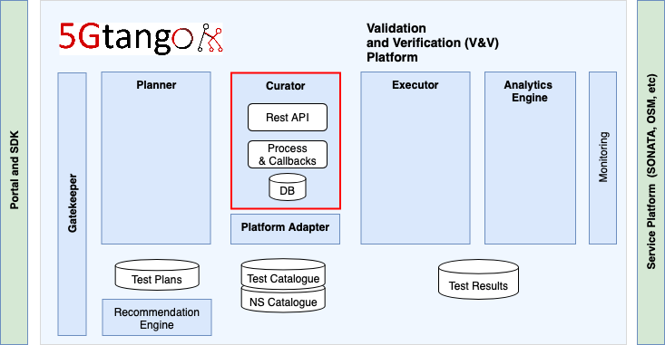

# tng-vnv-curator
This is a [5GTANGO](http://www.5gtango.eu) component to coordinate the verification and validation activities of 5G Network Services

<p align="center"></p>

[](https://jenkins.sonata-nfv.eu/job/tng-vnv-curator)

## Curator

The Curator acts as the intermediate module between the Planner and the Executor for all V&V tests activities. It is responsible for processing a Test Plan, preparing the SP environment for tests, processing instantiation parameters, triggering the execution and cleaning up the environment afterwards.



## Installing / Getting started

Curator should run in coexistence with the rest of components inside the VnV to run properly, however, to execute it as a standalone component for debuging purposes, it can be ran as follows. It is recommended to use a virtual environment for this purpose.

It's important to use tests and network services compatible with each other. Test parameters which are relying on an instantiation, should be addressed in the test descriptor as follows:

```
$(<function name>/<path>/<object>
```
Where _<function name>_ is the name of the VNF, _<path>_ is how it is addressed  in the instantiation parameters and _<object>_ is the desired record useful for the test.


```shell
python -m pip install --upgrade pip setuptools wheel
python setup.py install
```

To execute it

```shell
tng-vnv-curator
```

It runs the python application, serving at port 6200 by default.

To run it integrated with the rest of SONATA as a docker container:

```shell
docker pull registry.sonata-nfv.eu:5000/tng-vnv-curator
docker run -d --name tng-vnv-curator -p 6200:6200 registry.sonata-nfv.eu:5000/tng-vnv-curator
```
It is recommended to use the [quick guide](https://sonata-nfv.github.io/vnv-installation) to install the whole V&V platform.

## Developing

### Built with

Front end is developed in flask under python 3.6, and backend uses requests and docker api.

The whole list of python libraries uses is included in setup.py:

 * docker>=3.7.0
 * Flask>=1.0.0
 * flask-log-request-id
 * requests
 * six
 * urllib3
 * psycopg2-binary
 * coloredlogs
 
### Prerequisites

It is needed python3.6 It is recommended to have **virtualenv** installed and setup a workspace separated from the whole system.

### Setting up Dev

Setting up a development environment is easy

```shell
git clone https://github.com/sonata-nfv/tng-vnv-curator.git
cd tng-vnv-curator/

# Optionally setup a virtual environment
virtualenv -p python3 venv
source venv/bin/activate

python -m pip install --upgrade pip setuptools wheel
```

### Building

To install the module (after seting up dev)

```shell
python setup.py develop
```

### Deploying / Publishing

```shell
tng-vnv-curator
```

## Versioning

For the versions available, see the [link to tags on this repository](https://github.com/sonata-nfv/tng-vnv-curator/releases).

## Api Reference

Planner can access the REST API described in this [swagger](swagger.json)

## Dependencies

`docker (18.x)`

## Contributing
For contributing to the Curator you must:

1. Clone [this repository](http://github.com/sonata-nfv/tng-vnv-curator);
1. Work on your proposed changes, preferably through submiting [issues](https://github.com/sonata-nfv/tng-vnv-curator/issues);
1. Submit a Pull Request;
1. Follow/answer related [issues](https://github.com/sonata-nfv/tng-vnv-curator/issues) (see Feedback, below).

## Licensing

This 5GTANGO component is published under Apache 2.0 license. Please see the [LICENSE](LICENSE) file for more details.

## Lead Developers

The following lead developers are responsible for this repository and have admin rights. They can, for example, merge pull requests.

* Juan Luis de la Cruz ([juanlucruz](https://github.com/juanlucruz))

Reviewers:

* Felipe Vicens ([felipevicens](https://github.com/felipevicens))
* José Bonnet ([jbonnet](https://github.com/jbonnet))

## Feedback-Channel

- You may use the mailing list [sonata-dev-list](mailto:sonata-dev@lists.atosresearch.eu)
- Gitter room [](https://gitter.im/sonata-nfv/Lobby?utm_source=badge&utm_medium=badge&utm_campaign=pr-badge)


